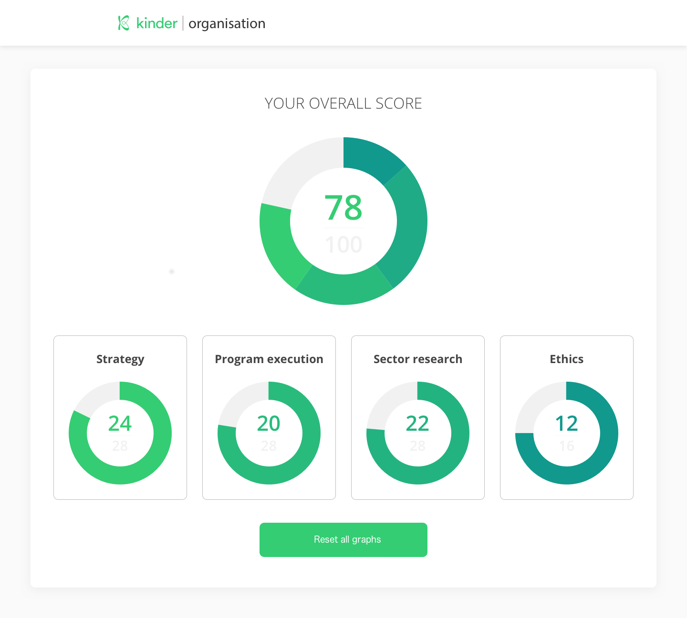

# Kinderworld Challenge

## What

Challenge for an internship at [Kinderworld](https://www.kinder-world.org/), Amsterdam-based startup. 

### Realise an app in Vue.js or React based on a given design

. 

I have chosen **Reactjs**.

## Requirements

**R1**.You should use Bootstrap 4 & Vue.js  
**R2**.Design should be responsive.  
**R3**.The top graph should display the combined values of the lower 4 graphs.   
**R4**.Clicking one of the lower 4 graphs should increase their value by 1.  
**R5**.Clicking the ”Reset all graphs” button should set the current value of each graph to 0   
**R6**.When the website is opened in multiple browser tabs, all tabs should display the
same values. This means that input in one tab should result in the values in all browser tabs to update.

